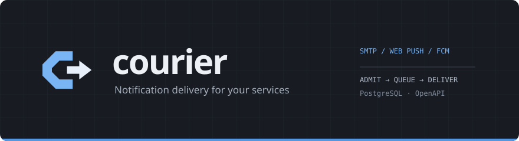

<div align="center">



<br/>

**Notification delivery for trusted services** — SMTP email, WebPush and FCM,
with localized templates, recipient preferences and a durable PostgreSQL queue.

[](https://github.com/gopherex/courier/actions/workflows/ci.yml)
[](https://gopherex.github.io/courier/)
[](https://go.dev/)
[](https://www.postgresql.org/)
[](openapi/openapi.yaml)
[](LICENSE)

**[Documentation](https://gopherex.github.io/courier/)** ·
[Quickstart](https://gopherex.github.io/courier/quickstart) ·
[Concepts](https://gopherex.github.io/courier/concepts/overview) ·
[Go SDK](https://gopherex.github.io/courier/sdk/go) ·
[TypeScript SDK](https://gopherex.github.io/courier/sdk/typescript) ·
[REST API](https://gopherex.github.io/courier/rest-api/overview) ·
[Self-hosting](https://gopherex.github.io/courier/self-hosting/docker)

</div>

---

Courier turns an application event into durable delivery jobs. Your service chooses
recipients and channels and supplies addresses and data. Courier applies preferences,
validates each channel's schema, renders templates and atomically queues the allowed
channels. A `202` response means **durably accepted**, not delivered.

One Go service serves the API, a Russian/English administrator console and queue
workers. PostgreSQL is the only required infrastructure. The
[OpenAPI contract](openapi/openapi.yaml) generates the Go and TypeScript clients;
SQL schemas and queries generate the database types.

## Quickstart

Requirements: Go 1.26.2+, Node 22.23.1+, Yarn 1.22.22, Python 3, GNU Make,
a C compiler and Docker with Compose.

```sh
make node-deps build
make dev-env dev-up migrate
make run
```

Open **http://localhost:18080** and sign in with `COURIER_ADMIN_KEY` from the
local `.env`. `make dev-env` creates fresh secrets and refuses to overwrite an
existing file. Read test emails in **http://localhost:18025**.

Create a project, configure SMTP (`127.0.0.1:11025`, TLS `plain`, no credentials,
sender `courier@example.test`), then add a notification key with a strict schema
and a template in the project's default locale. Save and use **Test delivery**.
Plain SMTP requires development mode. See the [step-by-step guide](https://gopherex.github.io/courier/quickstart).

## Capabilities

- **Three channels.** SMTP, encrypted WebPush with VAPID, and FCM HTTP v1.
- **Project isolation.** Separate service keys, provider credentials and preferences.
- **Strict templates.** Per-channel data schemas, localized templates and HTML escaping.
- **Recipient choices.** Optional opaque `recipient_id`; explicit preferences override
  message defaults. No identity-service dependency or address book.
- **Durable admission.** Transactional enqueue and project-scoped idempotency; a failure
  in any allowed channel rejects the whole message.
- **Recovery.** Exponential backoff, jitter, renewable leases and replayable dead letters.
- **Operations.** Prometheus metrics, optional OTLP traces, JSON logs and health probes.

## Integrate

Issue a service key in the console, then send from your backend:

```sh
curl --fail-with-body http://localhost:18080/v1/messages \
  -H "Authorization: Bearer $COURIER_SERVICE_KEY" \
  -H 'Content-Type: application/json' \
  --data '{
    "notification_key":"registration",
    "idempotency_key":"registration:event-42",
    "locale":"en",
    "deliveries":[{
      "channel":"email","default_enabled":true,
      "email":{"address":"alex@example.test"},
      "data":{"name":"Alex"}
    }]
  }'
```

First configure `registration` with a required `name` string and an email template.
Keep the same idempotency key and body when retrying an uncertain response.
Use the generated [Go SDK](https://gopherex.github.io/courier/sdk/go) or
[TypeScript SDK](https://gopherex.github.io/courier/sdk/typescript) for typed clients.
The TS SDK is published to GitHub Packages by the release workflow.

## Develop and verify

```sh
make help
make check              # lint, vet, unit/race tests, generation drift, SDK/UI build
make integration        # real PostgreSQL + SMTP with race detector
make browser-test       # requires running local stack and Playwright Chromium
make docs-deps docs-build
make generate           # OpenAPI → Go/TS; SQL → query types
make migration NAME=description
make release-plan       # preview the next release; no tag or push
make release            # interactive release, after a clean commit and green CI
```

Install Chromium with `yarn playwright install chromium`; use `CHROMIUM_PATH` for
an existing browser. All Go commands use `GOWORK=off`. CI runs checks, integration,
browser delivery tests and a Docker build. Docs have a separate strict build and
GitHub Pages deployment. See [testing](https://gopherex.github.io/courier/development/testing)
and [releasing](https://gopherex.github.io/courier/development/releasing).

## Repository

| Path | Purpose |
| --- | --- |
| [`openapi/`](openapi/) | Authoritative HTTP contract |
| [`cmd/courier/`](cmd/courier/) | Server and explicit migration command |
| [`internal/service/`](internal/service/) | Admission, administration, auth and relay |
| [`internal/delivery/`](internal/delivery/) | SMTP, WebPush and FCM adapters |
| [`internal/postgres/`](internal/postgres/) | SQL sources, generated queries and migrations |
| [`pkg/api/`](pkg/api/) · [`pkg/sdk/`](pkg/sdk/) | Generated Go client/server and service-key helper |
| [`sdk/ts/`](sdk/ts/) | Generated TypeScript SDK |
| [`web/`](web/) | Administrator console |
| [`website/`](website/) | Docusaurus documentation → GitHub Pages |
| [`docs/`](docs/) | Runtime contract and implementation references |
| [`third_party/schemapb/`](third_party/schemapb/) | Pinned upstream TS schema runtime and provenance |

## Deployment and scope

Build with `docker build -t courier .`. Run `courier migrate` as a deployment job
before starting the server. Supply database URL, administrator key, encryption key
and HTTPS public origin through runtime configuration. The image includes console
assets; a standalone binary needs `web/dist` alongside it.

Courier does not provide campaigns, identity management, channel fallback or
permanent message history. Delivery is at least once; uncertain provider outcomes
can produce duplicates. Successful payloads are cleared; dead letters have bounded
retention. Real WebPush/FCM delivery must be checked with your credentials and devices.
See [runtime semantics](docs/runtime.md) and
[configuration](https://gopherex.github.io/courier/self-hosting/configuration).

## License

[MIT](LICENSE). Vendored schemapb sources retain their upstream license.
